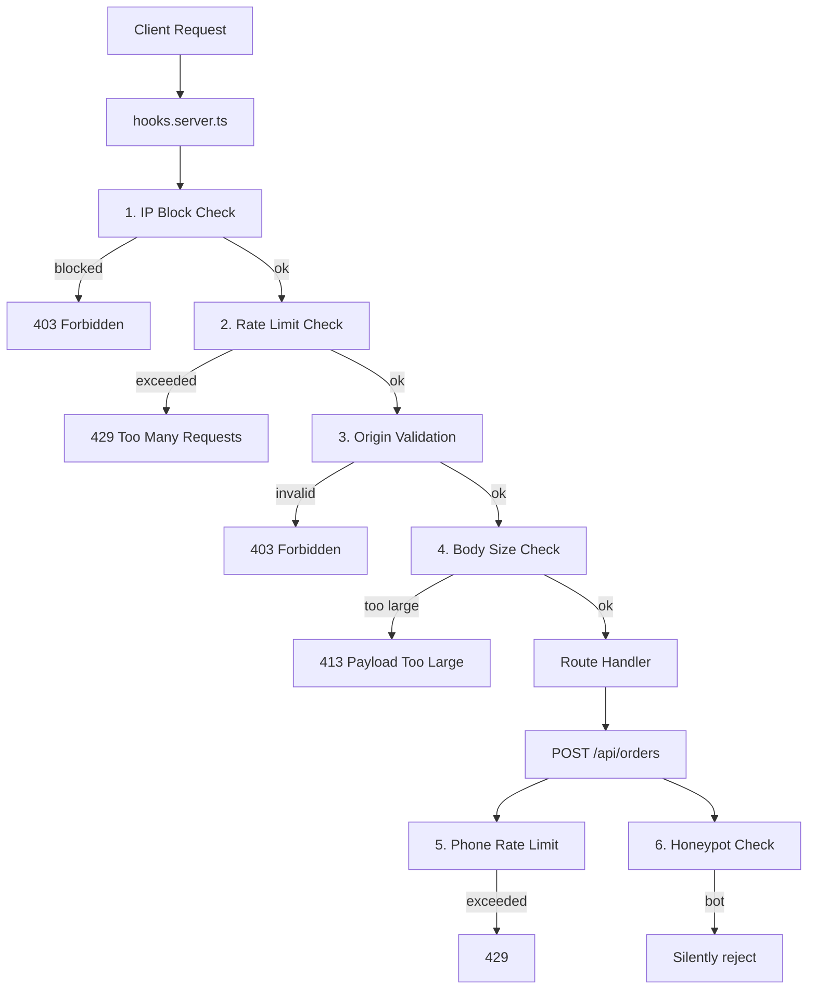

# Anti-Spam, DDoS & Security Hardening

## Current Security Status

- Zod validation on orders/reviews ([src/lib/utils/validation.ts](src/lib/utils/validation.ts))
- Admin auth via hooks ([src/hooks.server.ts](src/hooks.server.ts))
- Session isolation for order access
- **Missing**: Rate limiting, IP blocking, CSRF for API routes, security headers, anti-bot measures

## Architecture Overview




## Layer 1: Rate Limiting (in-memory sliding window)

Create `src/lib/server/rate-limit.ts` with a sliding window rate limiter using in-memory Map.

- On Vercel, serverless functions stay warm for minutes, so in-memory rate limiting catches rapid-fire/burst attacks effectively
- Different limits for different endpoint types:
  - **POST /api/orders**: 5 requests per IP per 15 minutes
  - **POST /api/reviews**: 5 requests per IP per 15 minutes  
  - **POST /api/admin/auth/login**: 5 attempts per IP per 15 minutes
  - **GET /api/**: 60 requests per IP per minute
  - **General pages**: 120 requests per IP per minute
- Periodic cleanup of expired entries to prevent memory leaks

## Layer 2: IP Blocking (Supabase + in-memory cache)

Create `src/lib/server/ip-block.ts` with Supabase-backed IP blocking and admin management.

**New Supabase migration** `supabase/migrations/003_blocked_ips.sql`:

```sql
CREATE TABLE blocked_ips (
  id uuid PRIMARY KEY DEFAULT gen_random_uuid(),
  ip_address text NOT NULL UNIQUE,
  reason text,
  blocked_by uuid REFERENCES admin_users(id),
  expires_at timestamptz,  -- NULL = permanent
  created_at timestamptz DEFAULT now()
);

CREATE INDEX idx_blocked_ips_address ON blocked_ips(ip_address);
CREATE INDEX idx_blocked_ips_expires ON blocked_ips(expires_at);
ALTER TABLE blocked_ips ENABLE ROW LEVEL SECURITY;
-- Only super_admin can manage
CREATE POLICY "admin_manage_blocked_ips" ON blocked_ips
  FOR ALL USING (public.is_super_admin());
```

- Cache blocked IPs in memory with 60-second TTL to avoid querying Supabase on every request
- Support both permanent and time-based blocks (expires_at)
- Auto-block IPs that exceed rate limits repeatedly (e.g., 3 rate limit violations in 1 hour = auto-block for 24h)

## Layer 3: Origin/Referer Validation for API POST Requests

In [hooks.server.ts](src/hooks.server.ts), validate that POST/PATCH/DELETE requests to `/api/*` include a valid `Origin` header matching the app's domain. SvelteKit has built-in CSRF for form actions, but our ordering uses `fetch()` API calls which bypass that.

## Layer 4: Per-Phone Rate Limiting (Supabase query)

In [src/routes/api/orders/+server.ts](src/routes/api/orders/+server.ts), before creating an order, query Supabase to check how many pending/confirmed orders this phone number has in the last hour. Limit to 3 active orders per phone. This is the most effective anti-spam measure for fake orders since phone numbers are validated as Vietnamese format.

## Layer 5: Honeypot Field

Add a hidden `website` field to the order form in [src/routes/cart/+page.svelte](src/routes/cart/+page.svelte). Bots auto-fill all fields; humans never see it. If filled, silently return a fake success response (200 with fake orderId) so bots think they succeeded.

Update `orderSchema` in [validation.ts](src/lib/utils/validation.ts) to include optional `website` field.

## Layer 6: Security Headers

Add security response headers in [hooks.server.ts](src/hooks.server.ts):

- `X-Content-Type-Options: nosniff`
- `X-Frame-Options: DENY`
- `Referrer-Policy: strict-origin-when-cross-origin`
- `Permissions-Policy: camera=(), microphone=(), geolocation=()`
- `Content-Security-Policy` (basic policy)

## Layer 7: Request Body Size Limit

In [hooks.server.ts](src/hooks.server.ts), check `Content-Length` header for POST requests. Reject payloads larger than 100KB for public API routes (orders/reviews). This prevents payload-based abuse.

## Layer 8: Admin IP Management API

Create new admin endpoints:

- `GET /api/admin/blocked-ips` -- list blocked IPs
- `POST /api/admin/blocked-ips` -- block an IP
- `DELETE /api/admin/blocked-ips/[id]` -- unblock an IP

These are protected by existing admin auth in hooks.server.ts.

## Files to Create


| File                                               | Purpose                                      |
| -------------------------------------------------- | -------------------------------------------- |
| `src/lib/server/rate-limit.ts`                     | Sliding window rate limiter                  |
| `src/lib/server/ip-block.ts`                       | IP blocking with Supabase + cache            |
| `src/lib/server/security.ts`                       | Security headers, origin validation, helpers |
| `supabase/migrations/003_blocked_ips.sql`          | blocked_ips table                            |
| `src/routes/api/admin/blocked-ips/+server.ts`      | Admin API: list + block IP                   |
| `src/routes/api/admin/blocked-ips/[id]/+server.ts` | Admin API: unblock IP                        |


## Files to Modify


| File                               | Changes                                                                                                 |
| ---------------------------------- | ------------------------------------------------------------------------------------------------------- |
| `src/hooks.server.ts`              | Add security middleware chain (IP block, rate limit, origin check, body size, headers) using `sequence` |
| `src/routes/api/orders/+server.ts` | Add phone rate limit check + honeypot check                                                             |
| `src/routes/cart/+page.svelte`     | Add hidden honeypot field                                                                               |
| `src/lib/utils/validation.ts`      | Add honeypot field to orderSchema                                                                       |
| `src/app.d.ts`                     | Add `clientIp` to Locals type                                                                           |


## Vietnam Phone Input Enhancement

Update the phone input in [src/lib/components/OrderForm.svelte](src/lib/components/OrderForm.svelte) to provide a polished UX:

- Add a Vietnam flag prefix (inline SVG or text flag) with `+84` country code displayed inside the input
- Auto-format the phone number as user types: `0912 345 678` (groups of 4-3-3 after the leading 0) or display with `+84` prefix
- Strip formatting before sending to API (only digits sent to server)
- Keep the existing `inputmode="tel"` for mobile keyboards
- The current phone input (line 35-44) is a plain `<input>` -- replace with a styled wrapper that includes the flag + formatted input

Design approach for the input:

```
┌─────────────────────────────┐
│ 🇻🇳 +84 │ 0912 345 678      │
└─────────────────────────────┘
```

- Flag + `+84` as a non-editable prefix with a subtle border separator
- Use Tailwind classes matching the existing `rounded-xl border border-orange-200` style
- Auto-format on input: insert spaces after position 4 and 7 (for 10-digit numbers starting with 0)
- Bind the raw (unformatted) value back to `model.phone` so validation works unchanged

## IP Address Extraction

On Vercel, the real client IP is available via `x-forwarded-for` header. We'll extract this in hooks.server.ts and attach it to `event.locals.clientIp` for use in downstream handlers.