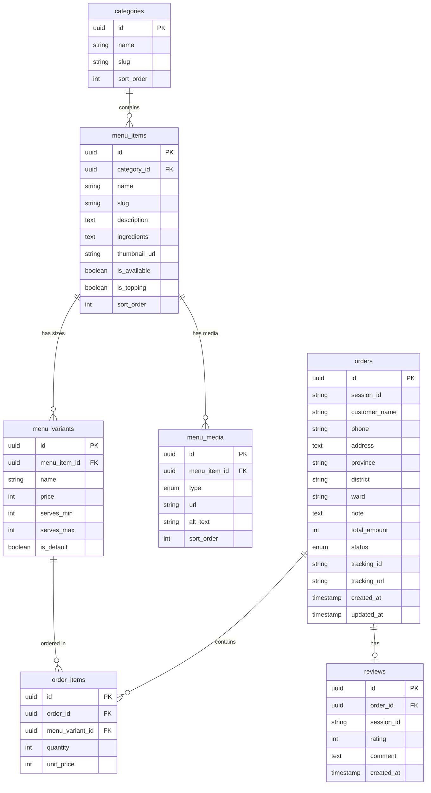

# Landing Page Tiệm Lẩu Anh Hai

## Tech Stack

- **Framework**: SvelteKit 5 (latest) - SSR cho SEO tối ưu
- **Styling**: Tailwind CSS 4
- **Database**: Supabase (PostgreSQL)
- **Session**: Browser localStorage với UUID

## Design System - Phong cách Miền Tây Nam Bộ

### Color Palette (dựa theo logo cam)

- **Primary**: `#F47B20` (Cam đậm từ logo) - Màu chủ đạo, gợi sự ấm áp
- **Primary Light**: `#FF9F45` (Cam nhạt) - Hover states, accents
- **Secondary**: `#8B4513` (Nâu gỗ) - Gợi nhớ nhà sàn, gỗ miền quê
- **Accent**: `#228B22` (Xanh lá đồng ruộng) - Điểm nhấn thiên nhiên
- **Background**: `#FFF8F0` (Kem nhạt) - Nền ấm, dễ chịu
- **Surface**: `#FAEBD7` (Màu lá khô) - Cards, sections
- **Text Primary**: `#3D2314` (Nâu đậm) - Dễ đọc, ấm áp
- **Text Secondary**: `#6B4423` (Nâu trung) - Mô tả, placeholder

### Typography

- **Headings**: Playfair Display (Serif) - Tạo cảm giác hoài cổ, sang trọng
- **Body**: Montserrat (Sans-serif) - Hiện đại, dễ đọc trên mobile

### Design Elements - Miền Tây Nam Bộ

- Họa tiết lá dừa, hoa sen làm trang trí nhẹ
- Border radius mềm mại (organic shapes)
- Shadow nhẹ tạo chiều sâu
- Icon style: outlined, friendly
- Texture nền gợi nhớ tre nứa, lá chuối

### Logo

- File: `logo.png` (chữ A cam với sọc chéo)
- Sử dụng làm favicon và header logo

## Mobile-First Design (90% users on mobile)

### Nguyên tắc thiết kế

- **Mobile-first CSS**: Viết styles cho mobile trước, dùng `md:` và `lg:` cho màn hình lớn
- **Touch-friendly**: Tất cả buttons/links tối thiểu 44x44px tap target
- **Thumb zone**: Đặt actions quan trọng trong vùng dễ với tay (bottom 1/3 màn hình)

### Breakpoints

- **Mobile**: < 640px (default, thiết kế chính)
- **Tablet**: 640px - 1024px (`sm:`, `md:`)
- **Desktop**: > 1024px (`lg:`, `xl:`)

### Mobile UX Optimizations

- **Header**: Sticky, compact với hamburger menu
- **Menu Grid**: 1 cột trên mobile, 2-3 cột trên tablet/desktop
- **Cart**: Bottom sheet slide-up thay vì sidebar
- **Floating Button**: Kích thước lớn 56px, dễ tap
- **Forms**: Full-width inputs, large font (16px+ tránh zoom iOS)
- **Images**: Lazy loading, responsive srcset
- **Navigation**: Bottom navigation bar cho mobile
- **Scroll**: Smooth scroll, pull-to-refresh feel

### Performance cho Mobile

- **Critical CSS**: Inline CSS cho above-the-fold
- **Font Loading**: `font-display: swap` tránh FOIT
- **Image Optimization**: WebP với fallback, lazy load
- **Bundle Size**: Code splitting theo route
- **Offline**: Service worker cho basic offline support

### Touch Gestures

- Swipe để xóa item trong cart
- Pull down để refresh menu
- Tap và hold để xem chi tiết món nhanh

## Database Schema



**Order Status Enum**: `pending` | `confirmed` | `preparing` | `shipping` | `delivered` | `cancelled`

**Giải thích schema:**
- `menu_items`: Thông tin chung (tên, mô tả, nguyên liệu) + `thumbnail_url` cho ảnh đại diện hiển thị trong danh sách
- `menu_media`: Bảng riêng lưu nhiều hình ảnh + video cho mỗi món. `type` = `image` | `video`
- `menu_variants`: Các size/phần với giá riêng (VD: Lẩu 1-2 người 200k, 3-4 người 300k)
- `order_items` link tới `menu_variants` để lưu đúng size đã đặt

## Cấu trúc Project

```
src/
├── lib/
│   ├── components/
│   │   ├── Header.svelte
│   │   ├── BottomNav.svelte (Mobile navigation)
│   │   ├── Hero.svelte
│   │   ├── MenuSection.svelte
│   │   ├── MenuItem.svelte
│   │   ├── MenuDetail.svelte
│   │   ├── MediaGallery.svelte (Carousel ảnh + video)
│   │   ├── MenuFilter.svelte
│   │   ├── Cart.svelte (Bottom sheet on mobile)
│   │   ├── CartButton.svelte
│   │   ├── FloatingContact.svelte
│   │   ├── OrderForm.svelte
│   │   ├── OrderHistory.svelte
│   │   ├── ReviewForm.svelte
│   │   ├── BottomSheet.svelte (Reusable)
│   │   └── Footer.svelte
│   ├── stores/
│   │   ├── cart.ts
│   │   └── session.ts
│   ├── server/
│   │   └── supabase.ts
│   └── utils/
│       ├── validation.ts
│       └── format.ts
├── routes/
│   ├── +layout.svelte
│   ├── +page.svelte (Landing)
│   ├── +page.server.ts
│   ├── menu/
│   │   └── [slug]/
│   │       ├── +page.svelte (Menu Item Detail)
│   │       └── +page.server.ts
│   ├── cart/+page.svelte
│   ├── orders/
│   │   ├── +page.svelte
│   │   └── [id]/+page.svelte
│   ├── api/
│   │   ├── orders/+server.ts
│   │   └── reviews/+server.ts
│   └── admin/
│       ├── +page.svelte (Dashboard)
│       ├── orders/+page.svelte
│       └── menu/+page.svelte
├── app.css (Tailwind + custom styles)
└── app.html
static/
├── logo.png
├── menu.jpeg (Reference menu design)
└── images/
    ├── lau-mam.jpg
    ├── lau-cha-ca.jpg
    └── ... (food images)
```

## Tính năng chính

### 1. Landing Page (Mobile-First, SEO optimized)

- Hero section full-width với tagline "Hương vị lẩu miền Tây"
- Footer với social links và thông tin liên hệ
- Skeleton loading cho UX mượt

**Footer:**
- Logo + tên quán "Tiệm Lẩu Anh Hai"
- Địa chỉ quán, giờ mở cửa
- Social links (icons): Facebook, Zalo, TikTok
- Hotline / SĐT liên hệ
- Copyright

**Menu Filter & Navigation:**
- Sticky category tabs (Lẩu | Gọi Thêm | Đồ Uống) - scroll ngang trên mobile
- Tap tab → smooth scroll đến section tương ứng
- Filter theo khoảng giá (dưới 50k, 50-100k, 100-200k, trên 200k)
- Sort: Giá thấp → cao, Giá cao → thấp, Phổ biến
- Filter + Sort ẩn trong dropdown/bottom sheet để không chiếm không gian
- URL query params (`?category=lau&sort=price_asc`) cho SEO và share link

**Menu Grid:**
- **Mobile**: 1 cột, card ngang (thumbnail trái + info phải)
- **Tablet**: 2 cột grid
- **Desktop**: 3 cột grid
- Nút "Thêm vào giỏ" màu cam, min 48px height

**Menu Item Card:**
- Thumbnail ảnh đại diện (từ `thumbnail_url`)
- Tên món, giá (hoặc khoảng giá nếu nhiều variant)
- Badge "Video" nếu có video
- Tap vào card → mở trang chi tiết món

### 2. Menu Item Detail (`/menu/[slug]`)

Trang riêng cho SEO (không phải modal), có SSR.

**Media Gallery:**
- Swipeable carousel hình ảnh + video
- Ảnh: Full-width, pinch-to-zoom trên mobile
- Video: Inline player, tap to play, poster frame
- Dots indicator + thumbnail strip bên dưới (desktop)

**Thông tin món:**
- Tên món (heading lớn)
- Mô tả chi tiết
- Nguyên liệu (danh sách)
- Badge: is_topping, is_available

**Chọn Variant & Đặt hàng:**
- Radio buttons chọn size/phần (nếu có nhiều variant)
- Hiển thị giá tương ứng
- Số lượng: +/- selector
- Nút "Thêm vào giỏ" lớn, sticky ở bottom (mobile)

**Share Link:**
- Nút share nổi bật trên trang detail (icon share)
- Native Web Share API (mobile) - mở share sheet hệ thống (Zalo, Messenger, SMS...)
- Fallback (desktop): Copy link to clipboard + toast "Đã copy link"
- SEO meta tags cho mỗi món (Open Graph + Twitter Card):
  - `og:title` = Tên món
  - `og:description` = Mô tả ngắn
  - `og:image` = Thumbnail
  - `og:url` = `/menu/[slug]`
- Link share đẹp khi paste vào Facebook, Zalo, iMessage...

**Món liên quan:**
- Hiển thị 3-4 món cùng category bên dưới
- Gợi ý toppings đi kèm

### 3. Bottom Navigation (Mobile)

- Fixed bottom bar với: Home | Menu | Giỏ hàng | Đơn hàng
- Active state rõ ràng với màu cam
- Badge đỏ hiển thị số item trong cart

- Fixed góc phải dưới, kích thước 56px
- **Mobile**: Nằm trên bottom nav bar
- FAB style với animation expand
- Quick actions: Gọi điện, Zalo, Facebook Messenger

### 5. Giỏ hàng (Cart) - User Feature

**Cart Store (Svelte store + localStorage):**
- Lưu items: `{ variantId, name, price, quantity }`
- Persist qua page refresh
- Sync across tabs (storage event)

**Cart UI:**
- **Mobile**: Bottom sheet slide-up, swipe down để đóng
- **Desktop**: Sidebar drawer hoặc dropdown
- Hiển thị: Tên món, size/variant, số lượng, giá, tổng tiền
- Actions trên mỗi item:
  - +/- để thay đổi số lượng
  - Swipe left để xóa (mobile)
  - Nút X để xóa (desktop)
- Nút "Xóa tất cả" để clear cart
- Hiển thị tổng tiền và số món

**Cart Button (Header/Bottom Nav):**
- Icon giỏ hàng với badge số lượng
- Tap để mở Cart sheet/drawer

### 6. Checkout (Đặt hàng)

**Form thông tin:**
- Tên khách hàng (required)
- SĐT với `inputmode="tel"` và validation VN format
- Địa chỉ: Searchable dropdown Tỉnh > Quận > Phường > Chi tiết
- Ghi chú đơn hàng (optional)
- Font size 16px+ (tránh auto-zoom iOS)

**Session ID:**
- Tự động tạo UUID v4 khi lần đầu visit
- Lưu localStorage, dùng để track đơn hàng

**Submit Order:**
- Validate form + cart không rỗng
- POST to `/api/orders`
- Clear cart sau khi thành công
- Redirect đến trang chi tiết đơn hàng

### 7. Lịch sử đơn hàng (User)

- Hiển thị đơn hàng theo session_id của user
- Card list với status badge màu sắc
- Pull-to-refresh
- Mỗi đơn: Mã đơn, Ngày đặt, Tổng tiền, Trạng thái
- Tap để xem chi tiết:
  - Danh sách món đã đặt
  - Timeline trạng thái đơn (vertical)
  - Tracking link/ID (nếu có) - clickable
  - Nút đánh giá (nếu status = delivered)

### 8. Review và Rating

- Chỉ cho đơn `delivered`
- Verify session_id khớp với order
- Star rating với large tap targets
- Textarea cho comment

### 9. Admin Panel (Responsive)

**Layout:**
- **Mobile**: Simplified dashboard, bottom nav
- **Desktop**: Full sidebar layout với menu: Dashboard | Đơn hàng | Menu

**Dashboard (`/admin`):**
- Tổng quan: Số đơn mới, đang xử lý, hoàn thành
- Biểu đồ đơn hàng theo ngày (simple)
- Danh sách đơn hàng mới nhất

**Quản lý Đơn hàng (`/admin/orders`):**
- Danh sách đơn với filter theo status
- Search theo tên/SĐT khách
- Mỗi đơn hiển thị: ID, Khách hàng, Tổng tiền, Trạng thái, Ngày đặt

**Chi tiết & Cập nhật Đơn (`/admin/orders/[id]`):**
- Thông tin khách hàng: Tên, SĐT, Địa chỉ
- Danh sách món đã đặt
- **Update Status Dropdown:**
  - `pending` → Chờ xác nhận
  - `confirmed` → Đã xác nhận  
  - `preparing` → Đang chuẩn bị
  - `shipping` → Đang giao
  - `delivered` → Đã giao
  - `cancelled` → Đã hủy
- **Thêm Tracking Info:**
  - Input Tracking ID (mã vận đơn)
  - Input Tracking URL (link tra cứu)
- Nút Lưu thay đổi
- Timeline lịch sử thay đổi status

**Quản lý Menu (`/admin/menu`):**
- CRUD món ăn với modal forms
- Toggle is_available (ẩn/hiện món)
- Sắp xếp thứ tự hiển thị
- **Quản lý Media cho mỗi món:**
  - Upload nhiều hình ảnh (lưu Supabase Storage)
  - Upload video (hoặc paste URL YouTube/TikTok)
  - Drag-and-drop sắp xếp thứ tự media
  - Chọn ảnh thumbnail từ media list
  - Xóa media

## Setup Supabase

1. Tạo project tại [supabase.com](https://supabase.com)
2. Vào **Project Settings > API Keys**
3. Lấy keys từ:
   - **Publishable key** (`sb_publishable_...`) - dùng cho client
   - **Secret key** (`sb_secret_...`) - dùng cho server actions
4. Thêm vào `.env`:

```env
PUBLIC_SUPABASE_URL=https://your-project.supabase.co
PUBLIC_SUPABASE_PUBLISHABLE_KEY=sb_publishable_xxx
SUPABASE_SECRET_KEY=sb_secret_xxx
```

**Lưu ý:**
- `PUBLIC_` prefix = exposed to client (SvelteKit convention)
- `SUPABASE_SECRET_KEY` không có prefix = server-only
- Legacy keys (`anon`, `service_role`) vẫn hoạt động nếu project cũ

5. Chạy migration SQL trong Supabase SQL Editor

## Menu Data (từ menu.jpeg)

### Categories

| slug | name | sort_order |
|------|------|------------|
| lau | Lẩu | 1 |
| topping | Gọi Thêm | 2 |
| do-uong | Đồ Uống | 3 |

### Menu Items & Variants

#### Category: Lẩu

**1. Lẩu Mắm**
- Mô tả: Thanh vị nguyên bản
- Nguyên liệu: Cá hú tươi rói, thịt ba chỉ xào sả ớt thắm đậm trong nước lẩu mắm đặc trưng. Rau tươi mát mắt: Cà tím, rau đắng, rau muống, bắp chuối bào và bông súng.
- Variants:
  - 1-2 người ăn: 200,000đ
  - 3-4 người ăn: 300,000đ

**2. Lẩu Chả Cá Thác Lác Khổ Qua**
- Mô tả: Thanh mát giải nhiệt
- Nguyên liệu: Chả cá nhà làm 100% cá tươi tự cạo, quết thủ công theo công thức độc quyền. Nước dùng thanh mát vị ngọt từ xương hầm & nấm rơm, hòa quyện chút đắng nhẹ đặc trưng từ khổ qua, tạo hậu vị ngọt thanh.
- Variants:
  - 2-3 người ăn: 180,000đ

#### Category: Gọi Thêm (Toppings)

| Tên món | Giá |
|---------|-----|
| Bắp bò | 80,000đ |
| Bò mềm | 70,000đ |
| Cá hú | 70,000đ |
| Tôm | 50,000đ |
| Mực | 50,000đ |
| Rau lẩu mắm | 30,000đ |
| Rau lẩu chả cá | 30,000đ |
| Bún | 10,000đ |
| Mì gói | 3,000đ |

#### Category: Đồ Uống (placeholder - cần bổ sung)

| Tên món | Giá |
|---------|-----|
| Nước dừa tươi | 25,000đ |
| Trà đá | 5,000đ |
| Nước suối | 10,000đ |

